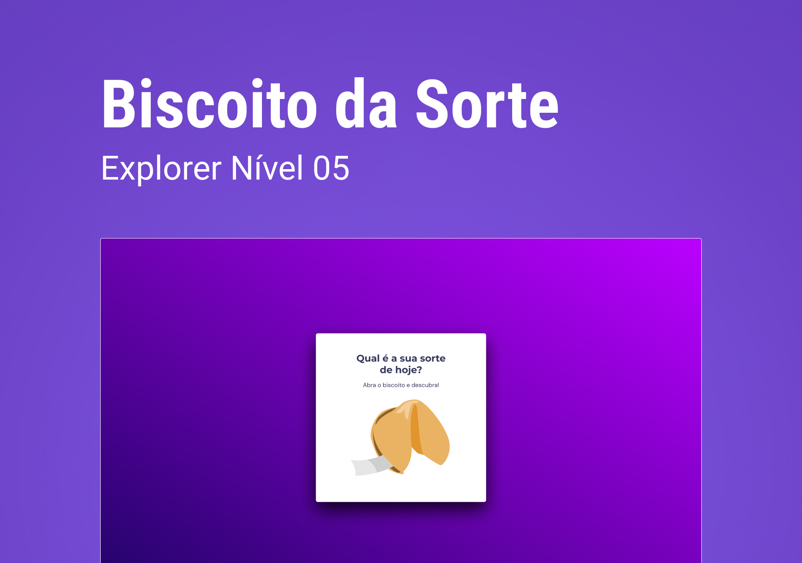
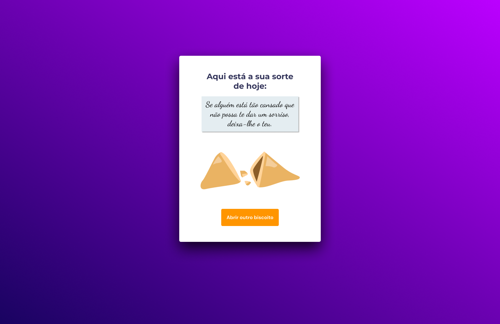

<h1 align="center"> Biscoito da sorte </h1>

Programa exclusivo, promovido pela trilha Explorer da Rocketseat para ensino de tecnologias WEB. 

- [Acesse o projeto finalizado, online](https://bernardosa01.github.io/Biscoito-da-sorte/)
  

  <a href="#-tecnologias">Tecnologias</a>&nbsp;&nbsp;&nbsp;|&nbsp;&nbsp;&nbsp;
  <a href="#-projeto">Projeto</a>&nbsp;&nbsp;&nbsp;|&nbsp;&nbsp;&nbsp;
  <a href="#-layout">Layout</a>&nbsp;&nbsp;&nbsp;|&nbsp;&nbsp;&nbsp;
  <a href="#memo-licença">Licença</a>

  

 

  

## 🚀 Tecnologias

Esse projeto foi desenvolvido com as seguintes tecnologias:

- HTML
- CSS
- JavaScript
- Git e Github
- Figma

## 💻 Projeto

- 
Nesta aplicação, o desafio foi criar um jogo chamado Biscoito da Sorte, no qual o usuário, a partir de um clique ou enter, abre um biscoito com a sua sorte do dia.    

- 
 Neste projeto, apliquei o aprendizado absorvido sobre vários temas, destacando-se:  

&nbsp;- Estrutura de dados HTML 
&nbsp;- Animações com CSS 
&nbsp;- Funções JavaScript 
&nbsp;- Manipulação da DOM 
&nbsp;- Biblioteca JS Math() 
&nbsp;- Funções *callback* 
&nbsp;- Arrays   

  

  

 

## 🔖 Layout

Você pode visualizar o layout do projeto através [DESSE LINK](https://www.figma.com/community/file/1182751789348533739). É necessário ter conta no [Figma](https://figma.com) para acessá-lo.

## :memo: Licença

Esse projeto está sob a licença MIT.

---

Feito por Bernardo Sá :wave: [Participe da comunidade da Rocketseat!](https://discord.gg/rocketseat)